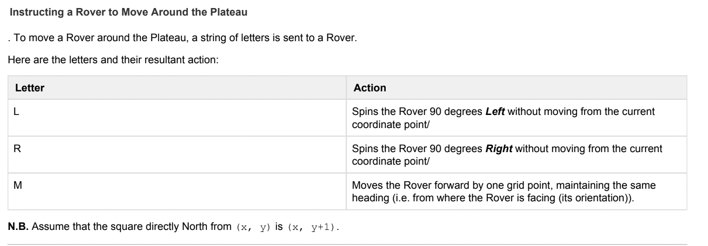
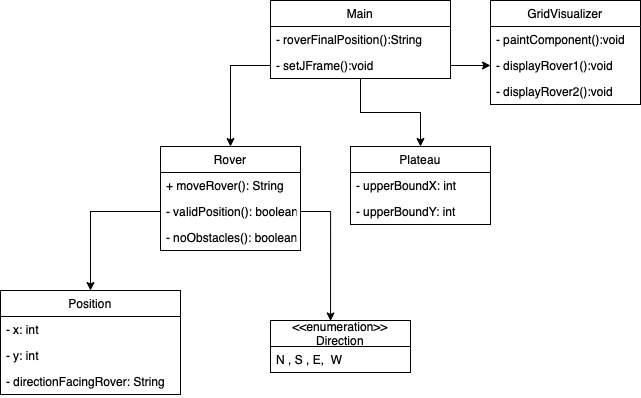
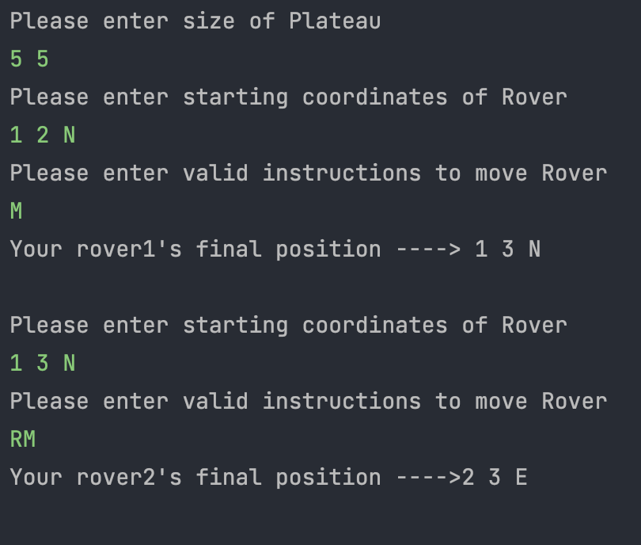

# Mars Rover

Console application that moves rovers around the surface of Mars.

A Rover’s position is represented by x and y co-ordinates and the letters N, S, W, E to represent North,
South, West, East (the four cardinal compass points) respectively.
Example
0 0 N



Assumptions:
- Plateau is a square (eg:5x5)
- Application currently can only move 2 rovers
- Application does not allow rover to move past the edges of the plateau.

## Class Diagram

## Features

A Rover’s position is represented by x and y co-ordinates and the letters N, S, W, E to represent North,
South, West, East (the four cardinal compass points) respectively.
### Inputs into the Program

- The first line inputted into the program represents the upper-right coordinates of the Plateau.
  5 5
  This Plateau has maximum (x, y) co-ordinates of (5, 5).
- Subsequent Lines of Input into the Program - Input to Rovers
  - Each rover receives two lines of input.
    - First Line of Input to a Rover
      The Rover’s position is represented by two integers representing the X and Y coordinates and a letter representing where the Rover is facing (its
      orientation).
      1 2 N
    - Second Line of Input to a Rover
      A string of letters representing the instructions to move the Rover around the Plateau.
      Movement Rules
      Rovers move sequentially, this means that the first Rover needs to finish moving first before the next one can move.
      Output
      For each Rover, the output represents its final position (final coordinates and where it is facing).


#### Example Test Case (Input)

#### Example Test Case (Output)

## Technologies
- Java 17.0.2
- Maven 3.8.5
- JUnit 5.8.2

## Running Application

To run application in terminal, run the following command

```bash
mvn exec:java -Dexec.mainClass="Main"
```
## Running Tests

To run tests, run the following command

```bash
mvn test
```
